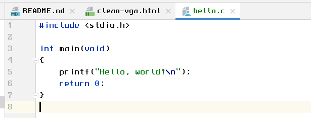

# Clean VGA

An old school VGA font based on VGA 8x14 from https://int10h.org/oldschool-pc-fonts/.

Purpose of this font:
- clean and simple
- no serif
- easy to read
- bitmaps in 12px, 14px, 16px, 18px and 20px (at 96dpi)
- monospaced
- good for computer terminals
- good for programming (0 != Oo, 1 != lIj|)

Rough edges:
- I don't know how to do fonts ;)

Here's a screenshot of the font in use:

## License

See https://int10h.org/oldschool-pc-fonts/readme/#legal_stuff
