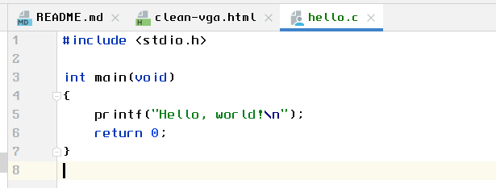
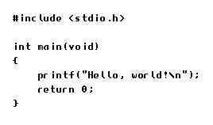
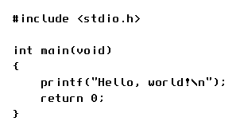
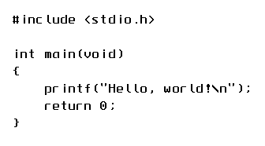
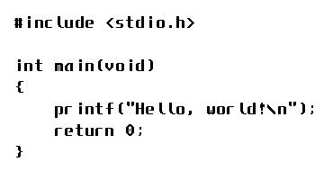

# Clean VGA

An old school VGA font based on VGA 8x14 from https://int10h.org/oldschool-pc-fonts/.

Purpose of this font:
- clean and simple
- no serif
- easy to read
- embedded bitmap strikes at 14px, 16px, 18px and 20px
- monospaced
- good for computer terminals
- good for programming (0 != Oo, 1 != lIj|)
- my only console/programming font since 2024; I look no further for a pixel-perfect font :)

Rough edges:
- I don't know how to do fonts ;)

Here's a screenshot of the font in use:

Interactive/browser sample entry point: [sample/index.html](sample/index.html)

And here are the embedded bitmap sizes rendered from the TTF with a white background and black text:

- 14px: 
- 16px: 
- 18px: 
- 20px: 

## License

See https://int10h.org/oldschool-pc-fonts/readme/#legal_stuff
